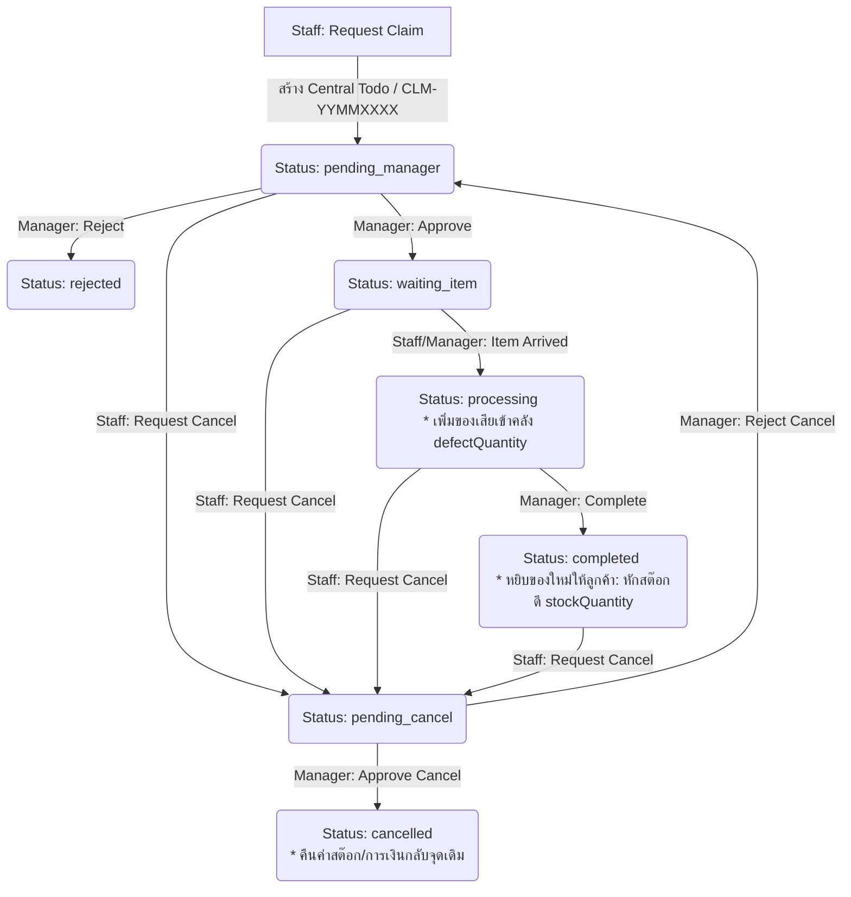

# 🔧 DH Notebook: Claims & Warranty Concept (แนวคิดระบบเคลมและการรับประกัน)

เอกสารนี้บันทึกแนวคิดทางธุรกิจ กฎการตัดสต๊อก และขั้นตอนการทำงาน (Workflow) สำหรับระบบจัดการเคลมสินค้าของ DH Notebook โดยเฉพาะ เพื่อใช้เป็นข้อตกลงและหลักการอ้างอิงในการเขียนโค้ด

---

## 📌 1. นโยบายการเคลมหลัก (Core Claim Policy)
*   **นโยบาย:** **"เปลี่ยนตัวใหม่ทันทีจากสต๊อกหน้าร้าน"**
*   **การปฏิบัติ:** เมื่อหน้าร้านตรวจสอบแล้วว่า **"สินค้าเสียจริง"** พนักงานจะหยิบสินค้าตัวใหม่จากสต๊อกดีหน้าร้านส่งมอบให้ลูกค้าทันที ส่วนตัวที่เสียจะถูกเก็บแยกไว้ในลังของเคลม (ลังของเสีย) เพื่อรวบรวมส่งเคลมกับซัพพลายเออร์ (Supplier) ในภายหลัง
*   **ผลกระทบทางคลังสินค้า:**
    *   ต้องตัดสต๊อกสินค้าดีในร้านทันทีเมื่อทำรายการเคลมเสร็จสิ้น (`stockQuantity` ลดลง)
    *   ต้องเพิ่มสต๊อกสินค้าเสียเข้าร้านทันทีเมื่อรับของจากลูกค้า (`defectQuantity` เพิ่มขึ้น) เพื่อนับจำนวนของเสียที่ค้างอยู่ในลังเคลม

---

## 🔄 2. วงจรสถานะของการเคลม (Claim Lifecycle)

เมื่อเริ่มรายการเคลมจากหน้าบิลสั่งซื้อ (Order) ในระบบหลังบ้าน (Backoffice) สถานะจะดำเนินตามลำดับขั้นตอนดังนี้:

### รายละเอียดแต่ละสถานะ (Status Details)
1.  **`pending_manager` (รออนุมัติ):** พนักงานหน้าร้านตรวจบิลของลูกค้า แล้วกดขอเคลมสินค้าในระบบ (ระบุรุ่น, จำนวน, และรหัสอาการเสีย) ระบบสร้างใบงานเคลมรหัส `CLM-YYMMXXXX` ขึ้นมาอยู่ในตารางงานส่วนกลาง (`todos`) เพื่อรอผู้จัดการอนุมัติ
2.  **`waiting_item` (รอรับสินค้าเสีย):** ผู้จัดการดูคำร้องและกดอนุมัติขั้นต้น เพื่อให้ลูกค้าส่งของหรือนำของเสียมาที่ร้าน
3.  **`processing` (ได้รับของเสียแล้ว/กำลังดำเนินการ):** เมื่อสินค้าเสียมาถึงร้าน พนักงานกดปุ่มได้รับของแล้ว ระบบจะ:
    *   เปลี่ยนสถานะเป็น `processing`
    *   **บวกสต๊อกของเสีย (`defectQuantity`)** เข้ารุ่นนั้นๆ ทันทีเพื่อบันทึกว่ามีของเสียเก็บอยู่ในลังเคลมหน้าร้าน
4.  **`completed` (เสร็จสิ้นการเคลม):** เมื่อหยิบสินค้าตัวใหม่ในสต๊อกดีส่งมอบให้ลูกค้าเรียบร้อย ผู้จัดการกดปิดงานเคลม ระบบจะ:
    *   **หักสต๊อกสินค้าดี (`stockQuantity`)** ของรุ่นนั้นๆ ทันที
    *   ส่งคิวซิงค์สต๊อกไปยัง Google Sheets เพื่ออัปเดตไฟล์สต๊อกส่วนกลาง (`gasStockService`)
    *   บันทึกข้อมูลและรหัสเคลมลงในประวัติการซื้อขาย (`refundsAndClaims`) ของบิลนั้นๆ
5.  **`rejected` (ปฏิเสธคำขอ):** ผู้จัดการไม่อนุมัติคำขอเคลม (เช่น อาการไม่ตรงเงื่อนไข หรือหมดประกัน)
6.  **`cancelled` (ยกเลิกรายการเคลม):** ใช้ในกรณีที่มีการขอยกเลิกใบเคลมย้อนหลัง (เช่น คีย์ผิด หรือลูกค้าขอคืนเงินแทน) หากผู้จัดการอนุมัติยกเลิก:
    *   ถ้ารับของเสียเข้าร้านมาแล้ว (`processing` หรือ `completed`) -> ระบบจะหักสต๊อกของเสียคืน
    *   ถ้าส่งมอบของใหม่ไปแล้ว (`completed`) -> ระบบจะบวกสต๊อกดีคืนเข้าร้าน และนำข้อมูลออกจากประวัติบิล

---

## 📊 3. ตารางสรุปผลกระทบทางสต๊อกและการเงิน (Stock & Finance Rules)

| รายการ | สต๊อกสินค้าดี (`stockQuantity`) | สต๊อกของเสีย (`defectQuantity`) | ผลกระทบทางการเงิน / บัญชี |
| :--- | :--- | :--- | :--- |
| **เคลมเปลี่ยนรุ่นเดิม** | `-qty` (เมื่อปิดงานสำเร็จ) | `+qty` (เมื่อได้รับของเสียเข้าร้าน) | ยอดบิลและยอดเงินของลูกค้าเท่าเดิม |
| **คืนสินค้า/คืนเงิน (Return)** | `+qty` (เมื่อเสร็จสิ้นเพื่อคืนคลังดี) | ไม่มีผลกระทบ | หักลดยอดขาย และโอนเงินคืนลูกค้า (Wallet/Cash) |
| **ยกเลิกใบเคลมย้อนหลัง** | `+qty` (ดึงของดีคืนคลัง) | `-qty` (ลบของเสียออกจากลัง) | ยอดบิลเท่าเดิม |
| **ยกเลิกใบรับคืนเงินย้อนหลัง** | `-qty` (ดึงของดีออกจากคลัง) | ไม่มีผลกระทบ | ดึงยอดเงินคืนกลับจากลูกค้า (บันทึกรายการจ่ายเงิน spend) |

---

## 🗣️ 4. ประเด็นสำหรับเตรียมพัฒนาต่อ (Next Phase Considerations)

*   **การเปลี่ยนสินค้าเป็นรุ่นอื่น (Swap SKU - แนวทางหลัก):** ใช้รูปแบบเบ็ดเสร็จในใบเคลมเดียว (Integrated Swap) โดยระบบต้องบันทึก SKU ใหม่, คำนวณส่วนต่างราคาทันที (ราคาตัวใหม่ - ราคาตัวเดิม), บันทึกธุรกรรมทางการเงินส่วนต่าง (ชำระเพิ่ม/ทอนคืน), และพิมพ์รายละเอียดส่วนต่างนี้ลงในใบเสร็จการเคลมด้วย
*   **การสแกน Serial Number (S/N Tracking):** (ข้ามการพัฒนา - ยังไม่มีความจำเป็นต้องทำระบบตรวจเช็ค S/N ในขณะนี้)
*   **เกณฑ์ระยะเวลาการรับประกัน (Warranty Rules - แนวทางหลัก):** ให้ระบบคำนวณและแสดงวันหมดอายุประกันของสินค้าอัตโนมัติ เพื่อเป็นข้อมูลสำหรับใช้ประกอบการพิจารณาบนหน้าจอเท่านั้น โดยจะไม่มีการแจ้งเตือนขัดขวางหรือการบังคับสิทธิ์ใดๆ ในระบบทั้งสิ้น (เน้นความยืดหยุ่นในการตัดสินใจของคน 100%)
*   **การเคลมส่งต่อ Supplier (Supplier Dispatch):** ระบบคลังเพื่อตัดสต๊อกของเสียออกจากลังเมื่อส่งให้ Supplier (พับเก็บแผนนี้ไว้ก่อน - ดูรายละเอียดที่ TODO.md)
